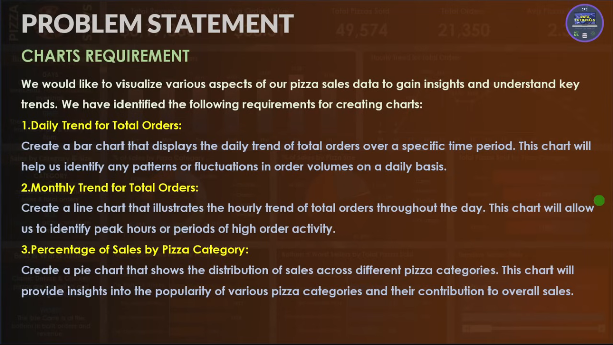
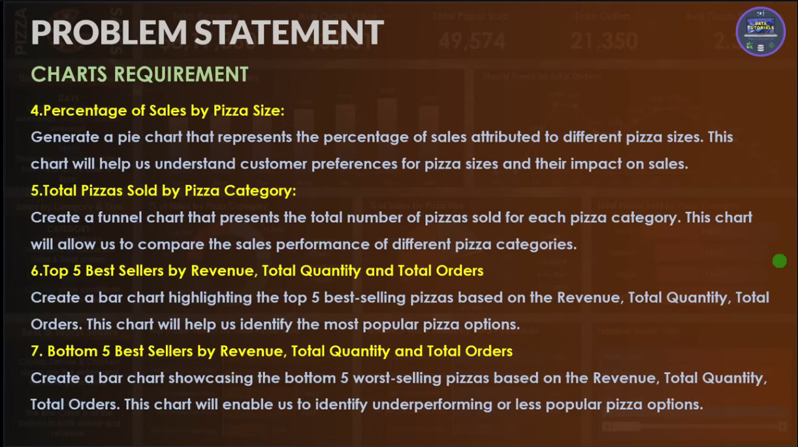
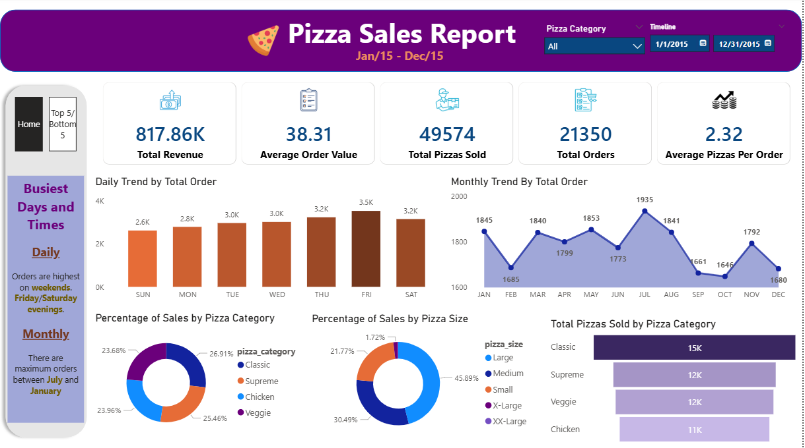
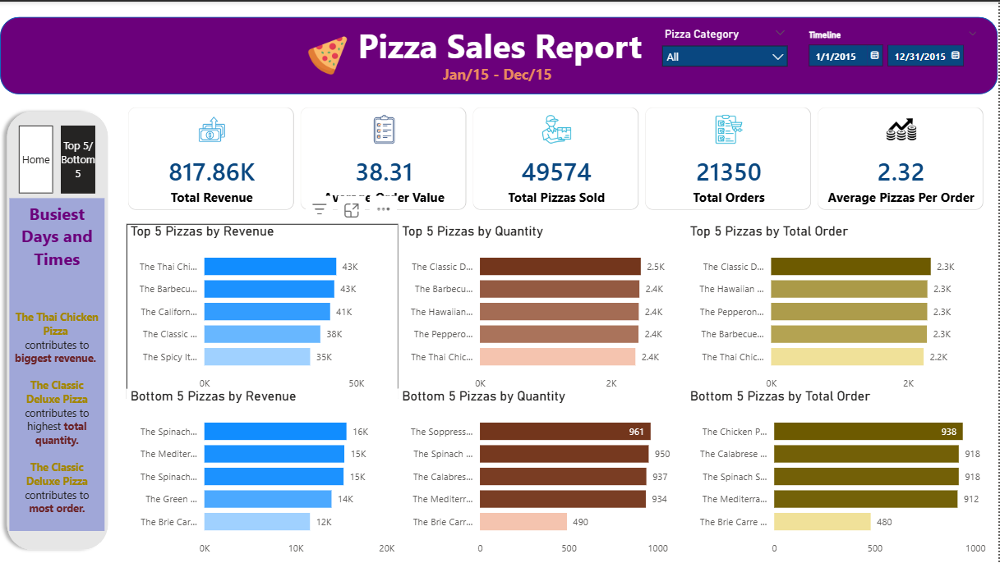
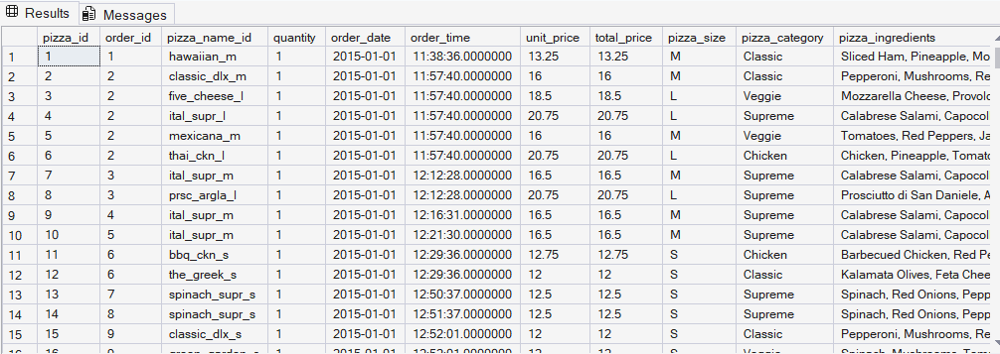
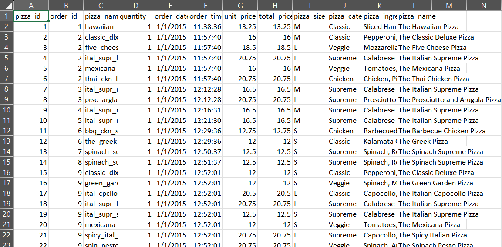

🍕 Pizza Sales Analytics (SQL + Power BI)
This project is an end-to-end data analysis workflow built around a pizza sales dataset.
The goal was simple: take raw transactional data and turn it into meaningful insights using SQL and Power BI.

________________________________________
📊 Project Overview
The dataset contains detailed order-level information including:
•	Order ID and date/time
•	Pizza names, sizes, and categories
•	Quantity and pricing
I used this data to calculate business KPIs and build an interactive dashboard that highlights trends, performance, and customer behavior.
________________________________________
🧰 Tech Stack
•	SQL (MSSQL) → Data querying and KPI calculations
•	Excel / CSV → Initial data handling and structure
•	Power BI → Data modeling, DAX measures, and dashboard creation
________________________________________
⚙️ What I Did
1. Data Preparation
•	Imported CSV/Excel data into SQL Server
•	Cleaned and structured the dataset
•	Ensured proper data types (dates, numeric fields, etc.)
2. SQL Analysis
Used SQL to calculate core business metrics:
•	Total Revenue
•	Average Order Value
•	Total Pizzas Sold
•	Total Orders
•	Average Pizzas per Order
These queries helped validate the numbers before moving into Power BI.
________________________________________
3. Power BI Dashboard
Built a fully interactive dashboard with:
KPI Cards
•	Total Revenue → 817.86K
•	Average Order Value → 38.31
•	Total Pizzas Sold → 49,574
•	Total Orders → 21,350
•	Avg Pizzas per Order → 2.32
Visualizations
•	Daily order trends (bar chart)
•	Monthly order trends (line chart)
•	Sales distribution by category (donut chart)
•	Sales distribution by pizza size (donut chart)
•	Total pizzas sold by category (bar chart)
Performance Analysis
•	Top 5 pizzas by:
o	Revenue
o	Quantity
o	Total orders
•	Bottom 5 pizzas (same metrics)
Filters
•	Pizza category slicer
•	Date range filter
________________________________________
📈 Key Insights
•	Classic category generates the highest number of sales overall
•	Large size pizzas contribute the biggest share of revenue
•	Orders peak toward the end of the week (Friday–Saturday)
•	Mid-year months show stronger performance compared to others
•	A few top pizzas drive a significant portion of total revenue
•	Some items consistently underperform and could be reviewed or removed
________________________________________
🧠 What I Learned
•	How to move from raw data → SQL → dashboard smoothly
•	Writing aggregation queries for business KPIs
•	Designing dashboards that are both clean and informative
•	Using filters and visuals to tell a clear story
